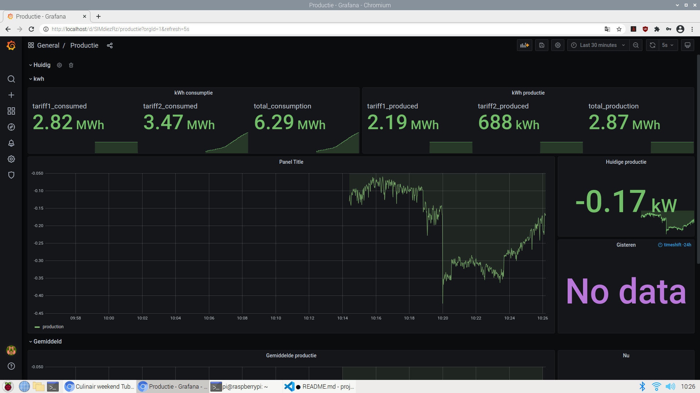

# p1-smart-meter
A repository to measure current belgian/dutch smart electricity/gas meter.
Built to run on linux/deployed on raspberry pi model 4.

It runs a grafana, no login. A postgres database with root/password, and a nodejs (javascript) container that reads our smart meter.
The raspberry pi is connected with the p1 port through a usb cable.

After running this, you can surf to the the ip adres, and grafana should run on the default port (80),
so if the ip adres of the raspberry pi is 192.168.0.165, that is where you can see it on your local network.

## Deploying
You will need docker-compose to deploy. Once installed, run:
```
#When in this directory (p1-smart-meter/$)
docker-compose build
docker-compose up -d
```

Now you can login to grafana, which should run on localhost.
You can login with admin/admin, and will then be asked to change the password. Then login again if logged out.
Then add a datasource, you should see this on home page, or on the left configuration and datasources.
Add a datasource:
```
#Don't make this public without changing passwords.
address: postgres:5432
database: root
username: root
password: password
Don't forget to disable ssl checking (it will complain otherwise)
```
Once done, you can import the dashboard:
Go to dashboards/manage, and you should see an import.
There you go to this project, and in the docker folder you'll see a Productie-xx...xx.json file, import this and select the postgres datasource. Now you should have a nice dashboard. 

An example of the dashboard:


### pgadmin
How to deploy pgadmin:
```
cd /tmp
git clone git clone https://github.com/postgres/pgadmin4.git
cd /tmp/pgadmin4
docker build -t "pgadmin4" .
```

## Requirements
### Deploying 
docker
docker-compose
### Development
npm
nodejs
docker
docker-compose

## Deployment
It's is build so all you have to do, is:
```
docker-compose up -d
```

This will start 3 docker containers, which starts a postgres sql database, grafana, and a nodejs container, that reads /dev/ttyUSB0.

The db folder contains the scripts that should auto create the database and index. If not:
´´´
docker exec -it postgres psql -U root
´´´

And then copy the sql in db, and paste it there.

#Disclaimer
It is by no means production code/secure, but we wanted to see our production/consumption live. So don't open it to the public (port forward it).
We run it on our local network, but you cannot see grafana on the outside world.
