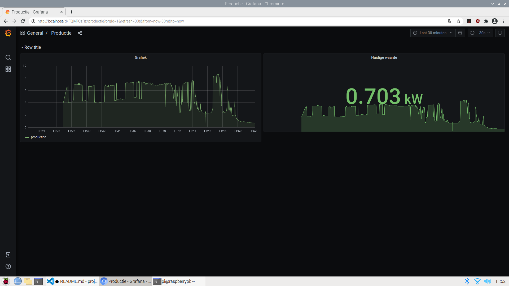

# p1-smart-meter
A repository to measure current belgian/dutch smart electricity/gas meter.
Built to run on linux/deployed on raspberry pi model 4.

It runs a grafana, no login. A postgres database with root/password, and a nodejs (javascript) container that reads our smart meter.
The raspberry pi is connected with the p1 port through a usb cable.

After running this, you can surf to the the ip adres, and grafana should run on the default port (80),
so if the ip adres of the raspberry pi is 192.168.0.165, that is where you can see it on your local network.

The dashboard, you will have to create yourself:

## Requirements
### Deploying 
docker
docker-compose
### Development
npm
nodejs
docker
docker-compose

## Deployment
It's is build so all you have to do, is:
´´´
docker-compose up -d
´´´

This will start 3 docker containers, which starts a postgres sql database, grafana, and a nodejs container, that reads /dev/ttyUSB0.

The db folder contains the scripts that should auto create the database and index. If not:
´´´
docker exec -it postgres psql -U root
´´´

And then copy the sql in db, and paste it there.

#Disclaimer
It is by no means production code/secure, but we wanted to see our production/consumption live. So don't open it to the public (port forward it).
We run it on our local network, but you cannot see grafana on the outside world.